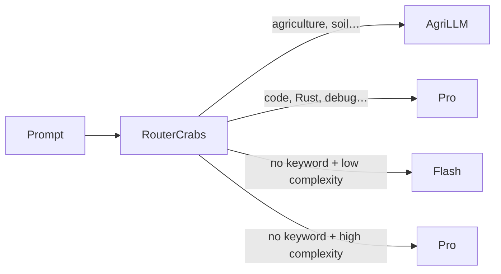

# RouterCrabs 🧭

A lightweight OpenAI-compatible proxy that automatically picks the right model based on **domain** or **complexity** of your prompt. Two routing modes, combinable:

- 🏷️ **Domain routing** — keywords → specialized model (agri → AgriLLM, code → Pro…)
- 🧠 **Complexity routing** — local heuristics → Flash (simple) or Pro (complex)
- 🔌 **Multi-provider** — each tier can point to a different provider
- ⚡ **Zero latency** — local classification, substring match + heuristics, <1ms
- 📦 **Single binary** — ~4 MB, no Docker, no database
- 🎯 **Native SSE streaming**



---

## Quick Start

```bash
git clone https://github.com/NadLad/RouterCrabs
cd RouterCrabs
cp tiers.yaml.example tiers.yaml
# Edit tiers.yaml → uncomment the [fallback] section + your domains
cp .env.example .env
# Edit .env → add your API keys
cargo run --release
```

Then in OpenCrabs (`~/.opencrabs/config.toml`):

```toml
[providers.custom.deepseek]
base_url = "http://localhost:8001/v1"
api_key = "not-needed"
default_model = "router-crabs"
```

---

## How It Works

### 1. Domain Routing (keywords)

Each tier defines a list of keywords. RouterCrabs scans the prompt for these keywords (substring, case-insensitive) and computes a score:

```
Score = match_count × tier_weight
```

The tier with the highest score wins. Ties are broken by `weight`, then `default: true`.

```
"Compare wheat and corn yields in organic agriculture"
  → "agriculture" matched → agri tier → AgriLLM ✅
```

### 2. Complexity Routing (fallback)

When **no domain keywords** match, RouterCrabs computes a **complexity score** (0–12) based on 5 local heuristics:

| Heuristic | Scoring |
|---|---|
| **Prompt length** | >2000 chars: +3<br>>800 chars: +2<br>>300 chars: +1 |
| **Code presence** | ≥3 markers (```, `fn`, `class`, `SELECT`…): +3<br>≥1: +2 |
| **Technical keywords** | ≥4: +3 (explain, architecture, algorithm, compare…)<br>≥2: +2<br>≥1: +1 |
| **Images** | +5 (always → Pro) |
| **Open-ended question** | `?` + why/how/what is/can you: +1 |

If score ≥ `threshold` → **complex** model. Otherwise → **simple** model.

```
"Hello"               → score 0 < 3 → DeepSeek Flash ✅
"Explain microservices → score 5 ≥ 3 → DeepSeek Pro   ✅
 architecture, compare
 performance tradeoffs"
```

#### Customizing Keywords — `keywords.yaml`

The technical keywords, question words, and code markers used for scoring are loaded from a separate YAML file. This file is **trilingual** by default (French, English, Arabic) and fully configurable:

```yaml
# keywords.yaml — RouterCrabs Complexity Scoring Keywords

code_markers:
  - "```"
  - "fn "
  - "class "
  - "SELECT "
  # ...

technical_keywords:
  - "explique"     # FR — explain
  - "explain"      # EN
  - "اشرح"         # AR
  - "algorithme"   # FR
  - "algorithm"    # EN
  - "خوارزمية"     # AR
  # ...

question_words:
  - "pourquoi"     # FR
  - "why"          # EN
  - "لماذا"        # AR
  # ...
```

If the file is missing or a section is empty, built-in defaults are used. Edit the file and restart the service — no recompilation needed.

### 3. Full Algorithm (hybrid)

```
1. Domain keywords → if match → specialized tier
2. Otherwise → complexity score → ≥ threshold → complex model
                                 → < threshold → simple model
3. Otherwise (no fallback section) → tier with default: true
```

---

## Configuration — `tiers.yaml`

```yaml
port: 8001
# host: "0.0.0.0"       # uncomment to bind to LAN
# keywords_path: "keywords.yaml"  # custom scoring keyword file

# ── Domain tiers (keywords) ──────────────────────────────
tiers:
  - model: "agrillm-v2"
    api_base: "https://api.agrillm.com/v1"
    api_key: "${AGRI_API_KEY}"
    keywords: [agriculture, agronomy, soil, plant, harvest, livestock]
    weight: 20

  - model: "deepseek-v4-pro"
    api_base: "https://api.deepseek.com"
    api_key: "${DEEPSEEK_API_KEY}"
    keywords: [code, Rust, Python, API, database, SQL, Docker, deployment]
    weight: 10

# ── Complexity routing (fallback) ──────────────────────
fallback:
  threshold: 3          # switch threshold: simple → complex
  simple:
    model: "deepseek-v4-flash"
    api_base: "https://api.deepseek.com"
    api_key: "${DEEPSEEK_API_KEY}"
  complex:
    model: "deepseek-v4-pro"
    api_base: "https://api.deepseek.com"
    api_key: "${DEEPSEEK_API_KEY}"
```

### Global Fields

| Field | Required | Default | Description |
|---|---|---|---|
| `port` | ❌ | `8001` | Listening port |
| `host` | ❌ | `127.0.0.1` | Bind address (`0.0.0.0` = LAN) |
| `keywords_path` | ❌ | `keywords.yaml` | Path to scoring keywords file |

### Tier Fields

| Field | Required | Default | Description |
|---|---|---|---|
| `model` | ✅ | — | Model to call |
| `api_base` | ✅ | — | API base URL |
| `api_key` | ✅ | — | Key (`${VAR}` = environment variable) |
| `auth_header` | ❌ | `Bearer` | Auth header (`x-api-key` for native Anthropic) |
| `keywords` | ❌ | `[]` | Keywords (lowercase, substring match) |
| `weight` | ❌ | `1` | Priority in case of a tie |
| `default` | ❌ | `false` | Ultimate fallback if no keywords nor `fallback` |

### Fallback Section Fields

| Field | Required | Default | Description |
|---|---|---|---|
| `threshold` | ❌ | `3` | Minimum complexity score to switch to `complex` |
| `simple.model` | ✅ | — | Model for simple requests |
| `simple.api_base` | ✅ | — | Base URL |
| `simple.api_key` | ✅ | — | API key |
| `complex.model` | ✅ | — | Model for complex requests |
| `complex.api_base` | ✅ | — | Base URL |
| `complex.api_key` | ✅ | — | API key |

---

## Debug

Every response includes headers to trace routing:

```
X-RouterCrabs-Tier:   complex-fallback
X-RouterCrabs-Model:  deepseek-v4-pro
X-RouterCrabs-Reason: complexity: high (score: 5, threshold: 3)
```

To see detailed scores:

```bash
RUST_LOG=debug cargo run --release
```

---

## Environment Variables

| Variable | Default | Description |
|---|---|---|
| `TIERS_CONFIG` | `tiers.yaml` | Path to the YAML config |
| `PORT` | `8001` | Listening port |
| `RUST_LOG` | `info,router_crabs=debug` | Log level |
| `*_API_KEY` | — | API keys (referenced in `tiers.yaml` via `${VAR}`) |

---

## Usage as a Rust Library

```rust
use router_crabs::{TiersConfig, Message, ScoringKeywords, select_tier, score_complexity, forward_request};

let config = TiersConfig::load("tiers.yaml")?;
let (tier, reason) = select_tier(&config, &messages);
let complexity = score_complexity(&messages, &config.keywords);
```

---

## License

MIT
